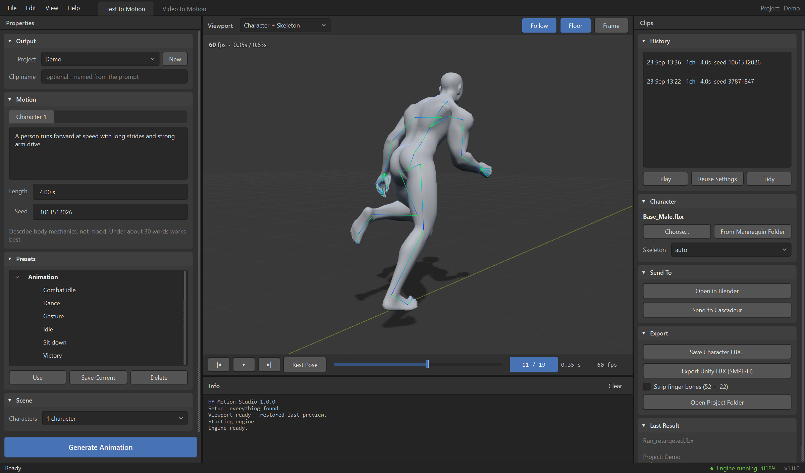
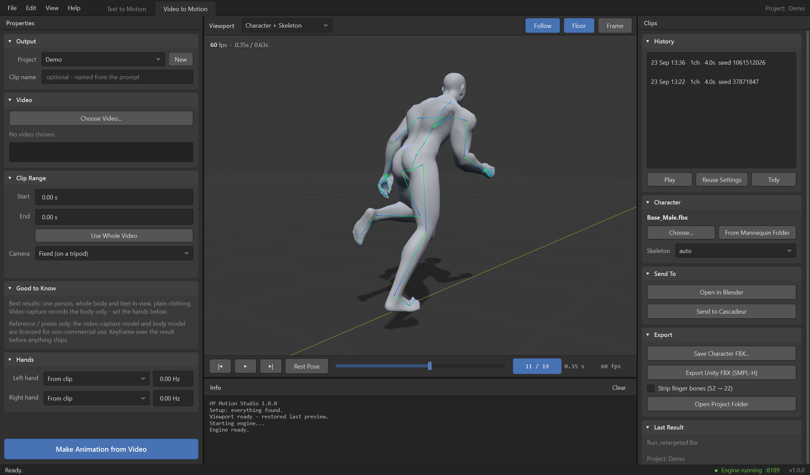
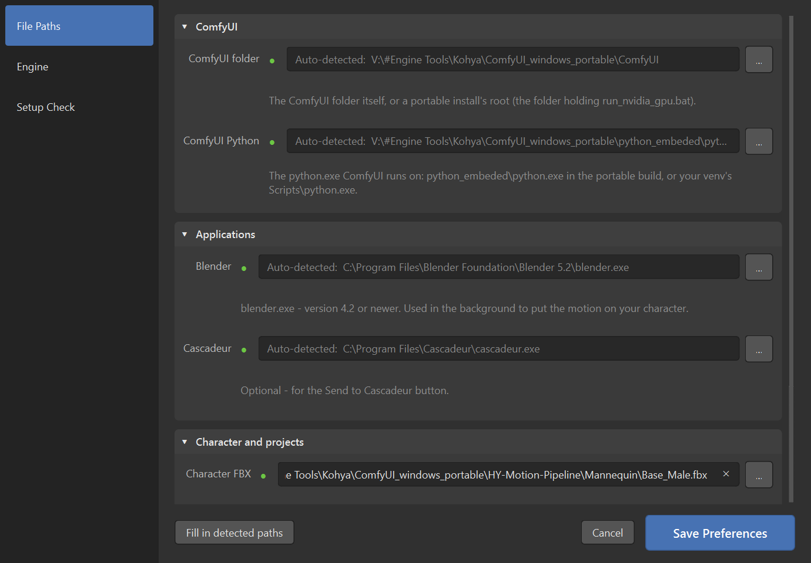

# HY Motion Studio

**Type a sentence or drop in a video — get character animation, on your own PC.**

HY Motion Studio is a free Windows desktop app for AI character animation. It
drives [HY-Motion 1.0](https://huggingface.co/tencent/HY-Motion-1.0) (Tencent's
text-to-motion model) and [GVHMR](https://github.com/zju3dv/GVHMR) video motion
capture through your own ComfyUI, puts the result on your character in Blender,
and shows it in a real-time 3D viewport — then hands it to Blender, Cascadeur
or Unity with one click.



## Features

- **Text to Motion** — describe a movement ("runs forward three steps and
  throws a right hook"), pick a length, press *Generate Animation*.
- **Video to Motion** — choose a video, set start and end, press *Make
  Animation from Video*. One person, whole body in view.
- **Your character** — the motion is retargeted onto any rigged FBX: Mixamo,
  Unreal UE4/UE5 (Manny, Quinn), 3ds Max Biped or Unity-Humanoid names.
  Two grey CC0 mannequins are included, so it works out of the box.
- **Hands** — pick a hand pose per side (relaxed, fist, open, point, grip),
  with an optional open/close cycle. Neither model produces finger motion, so
  this is where hands come from.
- **Two characters** — stage a second clip next to the first (distance,
  facing, reaction delay), adjustable while it plays.
- **Blender-style interface** — dark theme, fold-away panels, workspace tabs,
  timeline, History of every clip.
- **Hand-off** — *Open in Blender*, *Send to Cascadeur*, *Save Character FBX*,
  *Export Unity FBX*.
- **No console, no browser.** ComfyUI runs hidden in the background on its own
  port, so it never collides with a ComfyUI you already use.



---

## ⚠ Read this first — licences

HY Motion Studio's own code is GPL-3.0 and it ships **no AI models**. The
models you download have their own licences, and they matter if you plan to
use the animation in a product:

- **HY-Motion 1.0** — Tencent Hunyuan Community Licence. Its territory
  **excludes the EU, the UK and South Korea**, and products above a large
  user count need a separate licence from Tencent.
- **GVHMR** and the **SMPL-X body model** (video capture) — **non-commercial /
  research use only**. Treat video-captured motion as reference: keyframe over
  it before anything ships.

This is not legal advice — read the original licences. Full list in
[THIRD_PARTY_NOTICES.md](THIRD_PARTY_NOTICES.md).

---

## What you need

| | |
|---|---|
| **Windows 10 or 11** (64-bit) | The app is Windows-only for now. |
| **NVIDIA GPU, 16 GB VRAM** recommended | Tested on an RTX 4090 Laptop (16 GB). With less, use the *Lite* model and *Keep the text encoder on the CPU*. |
| **ComfyUI** | The [portable build](https://github.com/Comfy-Org/ComfyUI/releases) is easiest. |
| **Blender 4.2 or newer** | [blender.org](https://www.blender.org/download/). Runs in the background — you never have to open it. |
| About **20 GB of disk** | Mostly the models. |
| Cascadeur *(optional)* | For the *Send to Cascadeur* button. |

---

## Install

### 1. ComfyUI

Download the ComfyUI **portable** build for NVIDIA and unzip it, e.g. to
`C:\ComfyUI_windows_portable`. Run `run_nvidia_gpu.bat` once to check it
starts, then close it.

### 2. The HY-Motion nodes

Open a command prompt **in the `ComfyUI_windows_portable` folder** and run:

```bat
git clone https://github.com/jtydhr88/ComfyUI-HY-Motion1 ComfyUI\custom_nodes\ComfyUI-HY-Motion1
python_embeded\python.exe -m pip install -r ComfyUI\custom_nodes\ComfyUI-HY-Motion1\requirements.txt
```

No git? Download the repository as a ZIP from its GitHub page and unzip it into
`ComfyUI\custom_nodes\ComfyUI-HY-Motion1`, then run the second line. You can also
install **ComfyUI-HY-Motion1** from ComfyUI-Manager.

> **Protect your other ComfyUI workflows (optional).** To make sure pip can't
> change anything you already have, pin it first:
> ```bat
> python_embeded\python.exe -m pip freeze > constraints.txt
> python_embeded\python.exe -m pip install -r ComfyUI\custom_nodes\ComfyUI-HY-Motion1\requirements.txt -c constraints.txt
> ```

### 3. The models (~14 GB)

Still in the `ComfyUI_windows_portable` folder:

```bat
python_embeded\python.exe -c "from huggingface_hub import snapshot_download as d; d('tencent/HY-Motion-1.0', local_dir='ComfyUI/models/HY-Motion/ckpts/tencent')"
python_embeded\python.exe -c "from huggingface_hub import snapshot_download as d; d('unsloth/Qwen3-8B-bnb-4bit', local_dir='ComfyUI/models/HY-Motion/ckpts/Qwen3-8B-bnb-4bit')"
python_embeded\python.exe -c "from huggingface_hub import snapshot_download as d; d('openai/clip-vit-large-patch14', local_dir='ComfyUI/models/HY-Motion/ckpts/clip-vit-large-patch14', allow_patterns=['*.json','*.txt','model.safetensors'])"
```

You should end up with:

```
ComfyUI/models/HY-Motion/ckpts/
    tencent/HY-Motion-1.0/latest.ckpt
    tencent/HY-Motion-1.0-Lite/latest.ckpt
    Qwen3-8B-bnb-4bit/
    clip-vit-large-patch14/
```

### 4. Blender

Install Blender 4.2 or newer from [blender.org](https://www.blender.org/download/).

### 5. HY Motion Studio

**Easiest:** download `HY-Motion-Studio-win64.zip` from the
[Releases](../../releases) page, unzip it anywhere and double-click
**HY Motion Studio.exe**.

**From source:** download or clone this repository and double-click
`run_from_source.bat` (needs [Python 3.11](https://www.python.org/downloads/);
the first run sets itself up).

> **Tip:** put the app inside your `ComfyUI_windows_portable` folder and it
> finds ComfyUI by itself.

### 6. First launch

**Edit › Preferences** opens by itself the first time. Every location is
auto-detected where possible — a **green dot** means found, **red** means
point to it with the **…** button:

- **ComfyUI folder** — your `ComfyUI_windows_portable` folder
- **ComfyUI Python** — usually found automatically
- **Blender** — `blender.exe`
- **Character FBX** — leave it on the bundled mannequin, or choose your own

The **Setup Check** page lists anything still missing, and what to do about it.



---

## Optional: Video to Motion

1. Install the [ComfyUI-MotionCapture](https://github.com/PozzettiAndrea/ComfyUI-MotionCapture)
   nodes (ComfyUI-Manager → search **MotionCapture**). It sets up its own
   isolated environment on first run, which takes a while.
2. Register at [smpl-x.is.tue.mpg.de](https://smpl-x.is.tue.mpg.de) (free,
   non-commercial), download the SMPL-X model and put `SMPLX_NEUTRAL.npz` in
   `ComfyUI/models/motion_capture/body_models/smplx/`.
3. **If you also have the HY-Motion nodes:** open
   `ComfyUI/custom_nodes/ComfyUI-MotionCapture/comfy-env-root.toml` and delete
   the line `ComfyUI-HyMotion = "PozzettiAndrea/ComfyUI-HyMotion"`. It pulls in
   a second HY-Motion pack that clashes with the first. (Setup Check warns you
   about this.)

The helper models it needs download by themselves on the first video.

---

## Using it

**Text to Motion** — write what the *body* does (mechanics, not mood — under
about 30 words works best), set the length (up to 12 s), press *Generate
Animation* (or Ctrl+Enter). The first run of a session loads the models, so it
takes a minute longer. Presets are a good starting point.

**Video to Motion** — switch to the *Video to Motion* tab, *Choose Video…*,
set *Start* and *End*, pick *Fixed* or *Moving* camera, press *Make Animation
from Video*. Roughly half a second per video frame.

**The viewport** — drag to orbit, wheel to zoom, right-drag to pan. Space plays
and pauses, Home frames the character. *Follow* keeps a walking character in
shot.

**History** — every clip is kept. Double-click to play it again; *Reuse
Settings* copies its prompt or video range back.

**Where files go** — `Projects/<project>/`: `Generated/` (raw motion),
`Blender/` (your character, animated, as FBX + a preview GLB), `Input/`,
`Cascadeur/`, `Exports/`.

**Your own character** — any rigged humanoid FBX with Mixamo, Unreal, Biped or
Unity-Humanoid bone names. Drop it in the `Mannequin` folder or choose it in
Preferences. *Skeleton: auto* recognises the naming.

---

## Troubleshooting

| Problem | Fix |
|---|---|
| "Engine not running" | *Help › Setup Check*. Check the ComfyUI folder and Python in Preferences. Try running ComfyUI's own `run_nvidia_gpu.bat` to see its error. |
| Out of video memory | Use *HY-Motion-1.0-Lite*, tick *Keep the text encoder on the CPU* (under *Generation*), shorten the clip, close other GPU apps. |
| The character walks backwards | HY-Motion occasionally generates that. The Info log warns you; change the seed. |
| "Could not recognise the character's skeleton" | The FBX's bone names aren't Mixamo / Unreal / Biped / Unity. Rename them in Blender, or rig it with Mixamo. |
| Hands look stiff | Set a hand pose in *Hands*; the models make no finger motion. |
| You already run ComfyUI and want the app to use it | *Preferences › Engine*: set the port to yours (8188, or 8000 for ComfyUI Desktop) and untick *Start ComfyUI automatically*. |

---

## Build the exe yourself

Double-click `build.bat` (needs Python 3.11). It creates `HY Motion Studio\HY
Motion Studio.exe` and `HY-Motion-Studio-win64.zip` for a release.

## How the retargeting works

The motion arrives as an SMPL skeleton and is moved onto your character in
Blender by `blender/hym_retarget.py`:

- Limbs are aimed so every joint lands exactly on the source's direction.
- The spine keeps the source's change from standing, because skeletons put
  their spine joints in very different places.
- The two rigs are related by a pure turn about the vertical, so gravity is
  never tilted.

Measured against the source in world space: limbs within about 1°, spine
within 1-3° (the most on fast runs), walking direction correct. The header of that script has the
details.

## Credits

- [HY-Motion 1.0](https://huggingface.co/tencent/HY-Motion-1.0) — Tencent Hunyuan
- [ComfyUI-HY-Motion1](https://github.com/jtydhr88/ComfyUI-HY-Motion1) — jtydhr88
- [GVHMR](https://github.com/zju3dv/GVHMR) — ZJU3DV
- [ComfyUI-MotionCapture](https://github.com/PozzettiAndrea/ComfyUI-MotionCapture) — Andrea Pozzetti
- Mannequins: **Universal Base Characters** by [Quaternius](https://quaternius.com) (CC0)
- [three.js](https://threejs.org), [Qt for Python](https://doc.qt.io/qtforpython/), [Blender](https://www.blender.org), [ComfyUI](https://github.com/Comfy-Org/ComfyUI)

An independent community project — not affiliated with or endorsed by Tencent,
the Blender Foundation, Nekki (Cascadeur) or the authors above.

## Licence

[GPL-3.0](LICENSE). Third-party components: [THIRD_PARTY_NOTICES.md](THIRD_PARTY_NOTICES.md).
